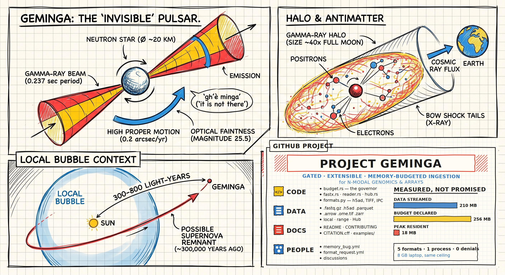

<p align="center">
  
</p>

<p align="center">
  
</p>

<p align="center">
  <b>G</b>ated, <b>E</b>xtensible, <b>M</b>emory-budgeted <b>I</b>ngestion for <b>N</b>-modal <b>G</b>enomics and <b>A</b>rrays
  <i>May work with many datasets outside of its initial design... </i>
</p>

<p align="center">
  <a href="#install"></a>
  <a href="LICENSE"></a>
  
  
</p>

**Stream any omics dataset through a memory budget you set.** Declare the bytes; GEMINGA derives
the chunking, enforces the ceiling, and blocks rather than over-committing.

Built for **resource-aware PhDs** — the ones who know exactly how much RAM they have, because
they have had to. Constraints are a given, not a defect: a laptop, a shared node with a quota,
a GPU with 8 GB, a disk that will not hold the dataset. GEMINGA treats the budget as the input
rather than the thing you discover when the kernel kills your job.

Named for Geminga, the pulsar in Gemini. Its discoverer Giovanni Bignami picked a name that
works twice over: a contraction of *Gemini gamma-ray source*, and *gh'è minga* — "it's not
there" in his native Milanese. A source that reads as absent while streaming steadily is a
fair description of a dataset you never download. The mark is its beam, broken into chunks.

> Figure notes: Geminga spins every 0.237 s, sits at roughly 815 light-years (250 pc, with
> older parallax work putting it nearer 500), shines at visual magnitude 25.5, and has a
> spin-down age near 340,000 years. The "300–800 light-years" in the panel is on the low
> side; ~800 is the current best estimate.

```python
import geminga as g

budget = g.Budget(ram="6GB", vram="4GB", spill="100GB")

for batch in g.open("org/dataset", budget=budget):        # remote Parquet, range-streamed
    ...
for chunk in g.open("reads.fastq.gz", budget=budget):     # FASTQ, parsed in Rust
    ...
for block in g.open("atlas.h5ad", budget=budget):         # scRNA/scATAC, CSR row blocks
    ...
for tile, win in g.open("slide.ome.tif", budget=budget, overlap=64):
    masks.write(model(tile), win)                          # never holds the whole slide
```

## What is actually different

Existing streaming APIs stream in **examples** — `batch_size`, `buffer_size`, both counted in
rows. Nothing tells you, or enforces, how many *bytes* are resident. On a 96 GB workstation you
never notice. On a 16 GB laptop you find out when the kernel kills the process.

GEMINGA inverts that: **you declare the bytes, the library derives the chunking.** Every reader

1. produces a **plan** before reading anything — chunk count, resident bytes per chunk,
2. **acquires** from a tier before materializing a chunk,
3. **releases** when the consumer asks for the next one.

Requests that can never fit fail immediately with a message naming the fix. Requests that merely
don't fit *right now* block until something releases. Three tiers: `ram`, `vram` (accounting for
memory you allocate via torch/cupy — GEMINGA refuses to let you over-commit it), and `spill`.

## Formats

| Format | Backend | Chunk unit | Notes |
|---|---|---|---|
| Parquet (local, HTTP, HF Hub) | Rust — `arrow`/`parquet` + `object_store` | row groups | HTTP range requests; footer-only inspection reads ~0.3 % of a file |
| FASTA / FASTQ (`.gz` ok) | Rust — `needletail` | byte-sized record runs | ~680 MB/s plain, ~90 MB/s gzipped, single core |
| h5ad (scRNA-seq, scATAC-seq) | Python — `h5py` | CSR row blocks (cells) | block size derived from `indptr`; CSC rejected with a fix |
| Arrow IPC / Feather | Python — `pyarrow` | record batches | memory-mapped |
| TIFF / OME-TIFF | Python — `tifffile`, native tile reader | image tiles, optional overlap | decodes only the tiles a window touches; no zarr dependency |
| Zarr / OME-Zarr | Python — `zarr` | image tiles | |

Everything tabular arrives as a zero-copy `pyarrow.RecordBatch`; imaging arrives as `numpy`.

## Measured

One 256 MB budget, every format, one process (`examples/all_formats.py`):

| Input | Size | Chunks | Peak resident |
|---|---|---|---|
| `reads.fastq` (200k reads) | 61.7 MB | 4 | 18.0 MB |
| `reads.fastq.gz` | 28.6 MB | 4 | 18.0 MB |
| `sc.h5ad` (20k cells × 3k genes, CSR) | 24.2 MB | 3 | 8.0 MB |
| `tissue.ome.tif` (6144², uint16) | 72.0 MB | 25 tiles | 4.0 MB |
| `test_bins.parquet` (2M rows) | 24.0 MB | 20 | 14.4 MB |

Budget high-water across all of it: **18.0 MB of 256 MB, 47 grants, 0 waits, 0 denials.**

The governor's three behaviours (`examples/budget_behaviour.py`):

- **Adaptive** — the same Parquet file at a 32 MB budget streams 8 MB chunks; at 128 MB, 32 MB chunks. Peak resident tracks the budget, never the file.
- **Backpressure** — with 20 of 24 MB held by something else, the first chunk arrives after 1.50 s instead of over-committing (`waits=1, wait_millis=1497`).
- **Fail fast** — a 64 MB chunk against a 4 MB budget raises `MemoryError: cannot fit 30.9 MB in the 'ram' tier (capacity 4.0 MB). Lower the chunk size (chunk_bytes / batch_size), or raise the budget for this tier.`

## Install

```
pip install geminga-0.1.0-*.whl                      # prebuilt, Linux x86_64, CPython 3.12
# from source (Rust >= 1.85, pip install maturin):
maturin build --release && pip install target/wheels/geminga-*.whl
```

Python extras by format: `h5py`+`scipy` (h5ad), `tifffile` (TIFF), `zarr` (Zarr, `MaskSink`).

## API

**Budget** — `Budget(ram="4GB", vram="0", spill="0", timeout_s=120)`; `.acquire(tier, size)`
returns a lease usable as a context manager; `.available(tier)`, `.stats()`, `.reset_peak()`.
Sizes parse as `"8GB"`, `"512MB"`, `"1.5GiB"`, or an integer byte count.

**Opening** — `g.open(target, budget=...)` dispatches on what the target is (Hub id, URL, or
path by extension). Explicit forms: `open_hub`, `open_urls`, `open_paths`, `open_fastx`,
`open_h5ad`, `open_arrow`, `open_image`.

**Planning** — `g.print_plan(reader)` or `reader.plan()` → `Plan(kind, n_chunks,
bytes_per_chunk, total_bytes, detail)`; `plan.fits(budget)`. For Parquet, `ds.plan(chunk_bytes,
columns)` gives rows per chunk and the projected width. Nothing is read.

**Parquet extras** (from the MEANDER core) — `ds.describe()`, `ds.stats()` (per-column min/max/
nulls from footers), `ds.schema()`, `ds.sample(n_row_groups, seed)`, `ds.materialize(path, ...)`,
`ds.transfer_stats()`.

**Sinks** — `ParquetSink(path)` appends batches without accumulating; `MaskSink(path, shape)`
writes per-tile segmentation output straight to a full-resolution Zarr array, offsetting instance
labels so ids stay unique across the image.

## Status and known gaps (v0.1)

- Local paths, local HTTP with `Range`, and all five formats are tested end to end
  (`examples/all_formats.py`, `budget_behaviour.py`, `local_roundtrip.py`).
- **Hub streaming (`open_hub`) is written against the documented datasets-server API but was
  not exercised live** — the build environment has no access to huggingface.co. Check that the
  `Range` header survives the redirect to the Xet CDN on first use.
- Parquet chunking is bounded below by the file's row-group size: a budget smaller than one row
  group cannot shrink the chunk further. `plan()` reports the real number.
- The `vram` tier is accounting only. It does not allocate or free device memory; it stops you
  from over-committing memory you allocate yourself.
- Leases are released when the consumer requests the next chunk. If you accumulate chunks in a
  list, acquire for them yourself.
- CSC-encoded h5ad is refused rather than silently reading every column chunk.
- No predicate pushdown yet (skipping Parquet row groups by min/max) — the statistics are already
  parsed, so this is the next step.
- Shared-memory parallelism is per-chunk and I/O-side (tokio) today; rayon across chunks is the
  obvious next win. MPI is deliberately out of scope — the target is one laptop, not a cluster.

Apache-2.0.

## Repository layout

```
src/                 Rust core — budget governor, Parquet range reader, FASTX parser
python/geminga/      Python API — dispatch, h5ad / Arrow / imaging readers, sinks
examples/            fixtures generator, per-format demos, budget behaviour demo
tests/               the invariant: peak resident never exceeds the declared budget
assets/              logo, infographic, social preview (see assets/README.md)
tools/               build_panel.py — regenerates the project panel of the infographic
.github/workflows/   CI: tests on 3.10/3.12/3.13, clippy + ruff, wheels for 3 platforms
```

## Roadmap

- [ ] Live Hub verification (`open_hub` against real datasets-server responses)
- [ ] Predicate pushdown — skip Parquet row groups by footer min/max (statistics already parsed)
- [ ] `geminga grep` — motif and adapter search over streamed sequence data, trigram-indexed
- [ ] rayon across chunks; free-threaded CPython 3.14t wheels
- [ ] BAM/CRAM via noodles; 10x `.h5`; OME-NGFF v0.5 multiscale
- [ ] `numba`-accelerated helpers for per-chunk QC on CSR blocks
